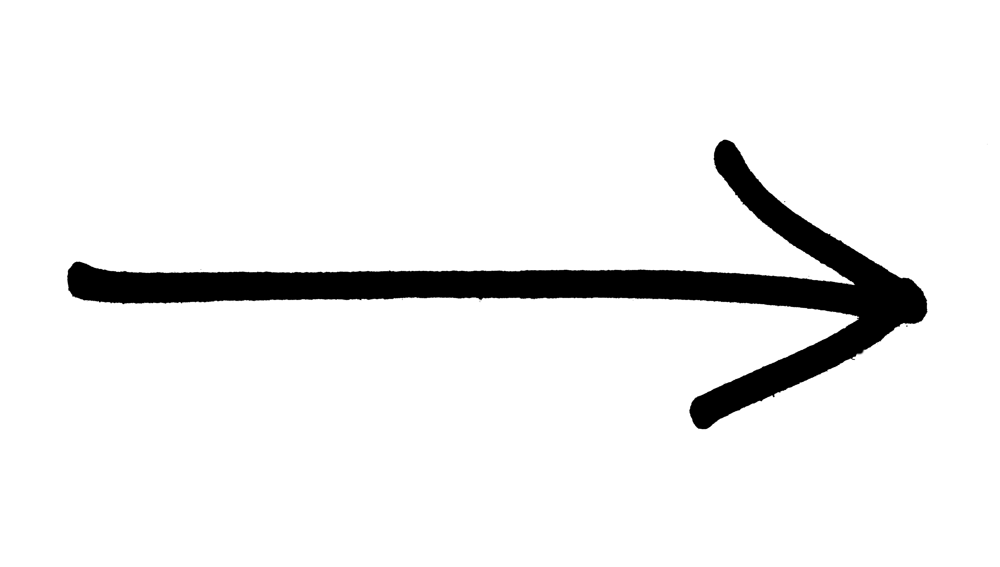

   

            
         

         <audio id="mysong">
            <source src="img/song.mp3" type="audio/mp3">
         </audio>

         

         /*---------- ScrollMagic----------*/

.animation{
    height: 100vh;
   
    background-repeat: no-repeat;
    background-position: center;
    position: relative;
    overflow: hidden;
}
.bool{
    height: 70px;
    position: absolute;
    top: 50%;
    left: 0;
}

<!--ScrollMagic-->

<section class="animation">
   
</section>

